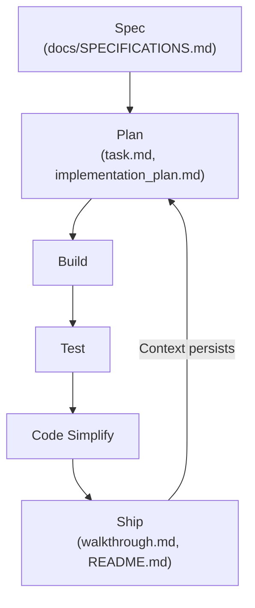

# ⚡ dbv-specs-ops

> *The blueprint that turns any AI assistant into a disciplined Senior Engineer.*
> *La plantilla que convierte cualquier asistente IA en un Ingeniero Senior disciplinado.*

<p align="right"><a href="#español">🇪🇸 Español</a> · <a href="#english">🇬🇧 English</a></p>


---

## 📑 Table of Contents / Índice

**🇬🇧 English**
- [Origin & Inspiration](#en-origin)
- [Visual Workflow](#en-workflow)
- [File Structure](#en-structure)
- [Platform Activation](#en-platforms)
- [Quick Start](#en-quickstart)
- [Adopting an Existing Project](#en-adoption)
- [Example Usage](#en-example)
- [FAQ](#en-faq)
- [Contributing](#en-contributing)

**🇪🇸 Español**
- [Origen e Inspiración](#es-origin)
- [Estructura de Archivos](#es-structure)
- [Activación por Plataforma](#es-platforms)
- [Cómo usar (Quick Start)](#es-quickstart)
- [Incorporar a un Proyecto Existente](#es-adoption)

**General**
- [Estado / Status](#status)
- [Autores y Créditos / Authors & Credits](#credits)
- [Inspiración y Referencias / Inspiration & References](#references)

---

<a name="english"></a>
## 🇬🇧 English

**dbv-specs-ops** is a lightweight engineering system designed to maximize software quality and context persistence in AI-assisted development.

This repository acts as a **master blueprint** that transforms your AI assistant from a simple code generator into a Senior Software Engineer that follows rigorous processes.

---

<a name="en-origin"></a>
### 📑 Origin & Inspiration

This workflow is a unified, simplified version of two industry pillars, adapted to be lightweight and highly effective:

1. **[Agent Skills (Google/Addy Osmani)](https://github.com/addyosmani/agent-skills):** The **process and technical workflow** (Cycle: Spec → Plan → Build → Test → Simplify → Ship).
2. **[GitHub Spec-Kit](https://github.com/github/spec-kit):** The **quality of specification**, focusing on understanding the problem, risks, and open questions before coding.
3. **[AI Coding Best Practices](https://github.com/davidbuenov/ai-coding-best-practices):** The final layer of **style and excellence** that dictates how the final code should be written.

---

<a name="en-workflow"></a>
### 🗺️ Visual Workflow



---

<a name="en-structure"></a>
### 📂 File Structure

#### `/docs` folder:
| File | Purpose |
|---|---|
| [`MASTER_PROMPT.md`](./docs/MASTER_PROMPT.md) | The brain of the system. Rules, workflow and constraints the AI must follow. |
| [`SPECIFICATIONS.md`](./docs/SPECIFICATIONS.md) | The "What" and "Why". Problem, objectives and acceptance criteria. |
| [`ARCHITECTURE.md`](./docs/ARCHITECTURE.md) | The "How". Tech stack, design decisions and system structure. |

#### Root:
| File | Purpose |
|---|---|
| [`task.md`](./task.md) | The logbook. Backlog, in-progress tasks and **Context Snapshots** to ensure the AI never loses the thread between sessions. |
| [`implementation_plan.md`](./implementation_plan.md) | Created at the `/plan` phase. Detailed technical plan for the AI to fill in and get approved before building. |
| [`walkthrough.md`](./walkthrough.md) | Created at the `/ship` phase. Summary of what was built, tested and delivered. |

---

<a name="en-platforms"></a>
### 🤖 Platform Activation

Each AI assistant loads context differently. Use the corresponding file:

| Platform | Activation file | Loading |
|---|---|---|
| **Claude Code** (CLI / VS Code / Desktop) | `CLAUDE.md` | Automatic at session start |
| **GitHub Copilot** (VS Code / JetBrains) | `.github/copilot-instructions.md` | Automatic in the workspace |
| **Cursor** | `CLAUDE.md` (compatible) | Automatic |
| **Antigravity** (VS Code · by Google DeepMind) | `GEMINI.md` (auto) + `ANTIGRAVITY.md` (docs & extra setup) | Automatic (+ optional manual KI setup) |
| **Windsurf** | `.windsurfrules` | Automatic |
| **ChatGPT / Gemini Web** | `docs/MASTER_PROMPT.md` | Manual: attach or paste in the first message |
| **Gemini CLI** | `GEMINI.md` | Automatic |

---

<a name="en-quickstart"></a>
### 🚀 Quick Start

This system requires no software installation — only **context installation**.

1. **Copy the full template:** Clone this repo or use it as a GitHub Template and copy **all files** to the root of your new project. Having all platform files lets you switch AI assistants at any time without reconfiguring anything.

2. **Activate the Master:**
   - **With auto-loading** (Claude Code, Copilot, Gemini CLI, Windsurf): the AI has already read the context, you can start directly.
   - **Antigravity**: context is loaded automatically from `GEMINI.md` (same mechanism as Gemini CLI). Read `ANTIGRAVITY.md` for Antigravity-specific features like Planning Mode artifacts and Knowledge Items.
   - **Without auto-loading** (ChatGPT, Gemini Web…): attach or paste the content of `docs/MASTER_PROMPT.md` in the first message.
   > *Suggested message:* "Act as my Senior Engineer following the rules of `./docs/MASTER_PROMPT.md`. Review `task.md` to start Phase 0."

3. **Engineering Interview:** The AI will read that we are in "Phase 0" and start asking questions to fill in `docs/SPECIFICATIONS.md`.

4. **Execution:** Once the plan is approved, just say: "Proceed with the next task in the `/plan`."

---

<a name="en-adoption"></a>
### 🔄 Adopting an Existing Project

Already have code but no specs or methodology? This flow lets you adopt SDD without starting from scratch.

1. Copy these template files to the root of your existing project.
2. Use `docs/ADOPTION_PROMPT.md` instead of the Phase 0 message.
   > *Suggested message:* "Follow the instructions in `docs/ADOPTION_PROMPT.md` to analyze this project and incorporate it into SDD methodology."
3. The AI will autonomously analyze your project (stack, tests, git history, existing docs) and present a summary before asking questions.
4. Answer the interview (6 questions, one at a time) to confirm the context.
5. The AI will generate `docs/SPECIFICATIONS.md`, `docs/ARCHITECTURE.md` and `task.md` with the real project state.

---

<a name="en-example"></a>
### 🧑‍💻 Example Usage

**1. Phase 0: Specification**

`docs/SPECIFICATIONS.md`:
```markdown
- Problema: "Los usuarios olvidan tareas importantes."
- Objetivo: "Crear un sistema de recordatorios multiplataforma."
- Funcionalidad A: "El usuario puede crear, editar y eliminar recordatorios."
```

**2. Plan:**

`task.md`:
```markdown
- [ ] Implementar modelo Reminder
- [ ] Crear API REST para recordatorios
- [ ] Añadir tests unitarios para Reminder
```

**3. Build / Test / Ship:**

The cycle continues until the result is delivered and documented in `walkthrough.md`.

---

<a name="en-faq"></a>
### ❓ FAQ

**Can I use this template with any AI assistant?**
Yes, it includes activation files for Claude, Copilot, Gemini, Antigravity, Windsurf and ChatGPT.

**What if I already have code?**
Follow the "Adopting an Existing Project" section and use `docs/ADOPTION_PROMPT.md`.

**What if the AI doesn't follow the cycle?**
Make sure it has read `docs/MASTER_PROMPT.md` and that the context is up to date in `task.md`.

**How do I contribute?**
Fork, create a descriptive branch, and open a Pull Request. See the Contributing section below.

---

<a name="en-contributing"></a>
### 🤝 Contributing

1. Fork the repository and create a descriptive branch.
2. Make your changes following the cycle: Spec → Plan → Build → Test → Simplify → Ship.
3. Open a Pull Request explaining the reason and the impact.
4. If it's a methodology improvement, add examples and update the documentation.

---
---

<a name="español"></a>
## 🇪🇸 Español

**dbv-specs-ops** es un motor de ingeniería simplificado diseñado para maximizar la calidad del software y la persistencia del contexto en el desarrollo asistido por Inteligencia Artificial.

Este repositorio actúa como un "Blueprint" o plano maestro que transforma a la IA de un simple generador de código en un Ingeniero de Software Senior que sigue procesos rigurosos.

---

<a name="es-origin"></a>
### 📑 Origen e Inspiración

Este flujo de trabajo es una versión unificada y simplificada de dos pilares de la industria:

1. **[Agent Skills (Google/Addy Osmani)](https://github.com/addyosmani/agent-skills):** El **proceso y el flujo de trabajo** técnico (Ciclo: Spec → Plan → Build → Test → Simplify → Ship).
2. **[GitHub Spec-Kit](https://github.com/github/spec-kit):** La **calidad de la especificación**, enfocándonos en entender el problema antes de codificar.
3. **[AI Coding Best Practices](https://github.com/davidbuenov/ai-coding-best-practices):** La capa de **estilo y excelencia** que dicta cómo debe escribirse el código final.

---

<a name="es-structure"></a>
### 📂 Estructura de Archivos

#### Carpeta `/docs`:
| Archivo | Propósito |
|---|---|
| [`MASTER_PROMPT.md`](./docs/MASTER_PROMPT.md) | El cerebro del sistema. Reglas, workflow y restricciones que la IA debe obedecer. |
| [`SPECIFICATIONS.md`](./docs/SPECIFICATIONS.md) | El "Qué" y el "Por qué". Problema, objetivos y criterios de aceptación. |
| [`ARCHITECTURE.md`](./docs/ARCHITECTURE.md) | El "Cómo". Stack tecnológico, decisiones de diseño y estructura del sistema. |

#### Raíz del proyecto:
| Archivo | Propósito |
|---|---|
| [`task.md`](./task.md) | El diario de a bordo. Backlog, tareas en curso y **Snapshots de Contexto**. |
| [`implementation_plan.md`](./implementation_plan.md) | Se crea en la fase `/plan`. Plan técnico detallado que la IA rellena y el usuario aprueba antes de construir. |
| [`walkthrough.md`](./walkthrough.md) | Se crea en la fase `/ship`. Resumen de lo construido, probado y entregado. |

---

<a name="es-platforms"></a>
### 🤖 Activación por Plataforma

| Plataforma | Archivo de activación | Carga |
|---|---|---|
| **Claude Code** (CLI / VS Code / Desktop) | `CLAUDE.md` | Automática al iniciar sesión |
| **GitHub Copilot** (VS Code / JetBrains) | `.github/copilot-instructions.md` | Automática en el workspace |
| **Cursor** | `CLAUDE.md` (compatible) | Automática |
| **Antigravity** (VS Code · by Google DeepMind) | `GEMINI.md` (auto) + `ANTIGRAVITY.md` (docs y config extra) | Automática (+ setup KI opcional) |
| **Windsurf** | `.windsurfrules` | Automática |
| **ChatGPT / Gemini Web** | `docs/MASTER_PROMPT.md` | Manual: adjunta o pega en el primer mensaje |
| **Gemini CLI** | `GEMINI.md` | Automática |

---

<a name="es-quickstart"></a>
### 🚀 Cómo usar (Quick Start)

Este sistema no requiere instalación de software, sino **instalación de contexto**.

1. **Copia la plantilla completa:** Clona este repo o úsalo como GitHub Template. Tener todos los archivos te permite cambiar de asistente de IA en cualquier momento.

2. **Activa el Maestro:**
   - **Con auto-carga** (Claude Code, Copilot, Gemini CLI, Windsurf): la IA ya ha leído el contexto.
   - **Antigravity**: el contexto se carga automáticamente desde `GEMINI.md` (mismo mecanismo que Gemini CLI). Lee `ANTIGRAVITY.md` para funciones específicas de Antigravity como los artefactos de Planning Mode y los Knowledge Items.
   - **Sin auto-carga** (ChatGPT, Gemini Web…): adjunta o pega `docs/MASTER_PROMPT.md` en el primer mensaje.
   > *Mensaje sugerido:* "Actúa como mi Ingeniero Senior siguiendo las reglas de `./docs/MASTER_PROMPT.md`. Revisa `task.md` para iniciar la Fase 0."

3. **Entrevista de Ingeniería:** La IA leerá que estamos en "Fase 0" y empezará a preguntarte detalles para rellenar `docs/SPECIFICATIONS.md`.

4. **Ejecución:** Una vez definido el plan, di: "Procede con la siguiente tarea del `/plan`."

---

<a name="es-adoption"></a>
### 🔄 Incorporar a un Proyecto Existente

1. Copia los archivos de esta plantilla a la raíz de tu proyecto existente.
2. Usa `docs/ADOPTION_PROMPT.md` en lugar del mensaje de la Fase 0.
   > *Mensaje sugerido:* "Sigue las instrucciones de `docs/ADOPTION_PROMPT.md` para analizar este proyecto e incorporarlo a la metodología SDD."
3. La IA analizará tu proyecto de forma autónoma y te presentará un resumen.
4. Responde la entrevista (6 preguntas, una a una).
5. La IA generará `docs/SPECIFICATIONS.md`, `docs/ARCHITECTURE.md` y `task.md` con el estado real.

---

<a name="status"></a>
## 🛠 Estado / Status

* **Versión / Version:** 1.1.0
* **Metodología / Methodology:** Spec-Driven Development (SDD)
* **Objetivo / Goal:** Universal AI-assisted development template for any platform and assistant.

---

<a name="credits"></a>
## ✍️ Autores y Créditos / Authors & Credits

### 👤 Concebido y dirigido por / Conceived and directed by

#### David Bueno Vallejo

> "Idea original, visión de la metodología, diseño del sistema de documentos, pruebas y refinamiento."
> "Original idea, methodology vision, document system design, testing and refinement."

[](https://www.linkedin.com/in/davidbueno/)
[](https://davidbuenov.com)

---

### 🤖 Construido con / Built with AI Pair Programming

| Tool | Role |
|---|---|
| **[Claude Code](https://claude.ai/code)** · *Anthropic* | Main agent: document structure design, prompt engineering, platform files, methodology refinement. |
| **[Antigravity](https://antigravity.google)** · *Google DeepMind* | Antigravity-specific integration, planning artifacts design, compatibility testing. |
| **[Gemini](https://gemini.google.com)** · *Google* | Methodology validation and adoption flow testing on existing projects. |
| **[ChatGPT](https://chatgpt.com)** · *OpenAI* | Manual flow review and `MASTER_PROMPT.md` compatibility with non-auto-loading models. |

> "La visión fue humana. La metodología fue una conversación."
> "The vision was human. The methodology was a conversation."

---

<a name="references"></a>
## 📚 Inspiración y Referencias / Inspiration & References

* **[Agent Skills](https://github.com/addyosmani/agent-skills)** — Addy Osmani (Google)
* **[GitHub Spec-Kit](https://github.com/github/spec-kit)** — GitHub
* **[AI Coding Best Practices](https://github.com/davidbuenov/ai-coding-best-practices)** — David Bueno Vallejo
