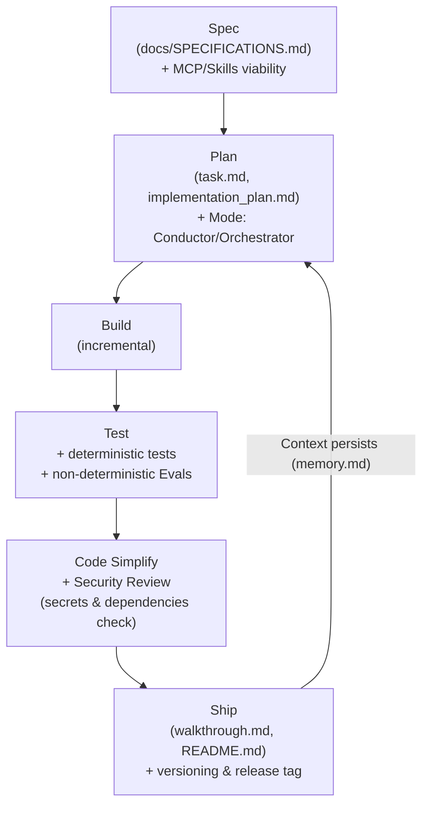
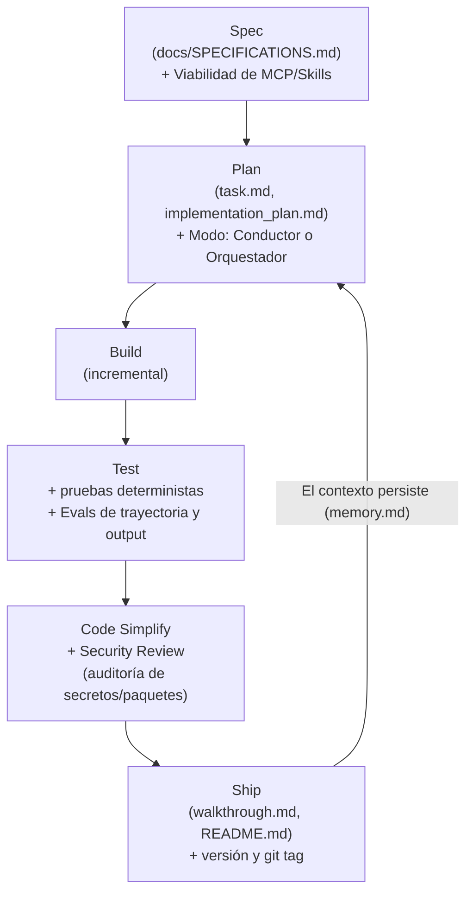

# ⚡ dbv-specs-ops

> *The blueprint that turns any AI assistant into a disciplined Senior Engineer.*
> *La plantilla que convierte cualquier asistente IA en un Ingeniero Senior disciplinado.*

<p align="right"><a href="#español">🇪🇸 Español</a> · <a href="#english">🇬🇧 English</a></p>


---

## 📑 Table of Contents / Índice

**🇬🇧 English**
- [Key Features](#en-features)
- [Origin & Inspiration](#en-origin)
- [Visual Workflow](#en-workflow)
- [The 6 Development Phases](#en-phases)
- [File Structure](#en-structure)
- [Platform Activation](#en-platforms)
- [Quick Start](#en-quickstart)
- [Adopting an Existing Project](#en-adoption)
- [Upgrading an Existing Project](#en-upgrade)
- [Example Usage](#en-example)
- [FAQ](#en-faq)
- [Contributing](#en-contributing)

**🇪🇸 Español**
- [Características Principales](#es-features)
- [Origen e Inspiración](#es-origin)
- [Flujo de Trabajo Visual](#es-workflow)
- [Las 6 Fases de Desarrollo](#es-phases)
- [Estructura de Archivos](#es-structure)
- [Activación por Plataforma](#es-platforms)
- [Cómo usar (Quick Start)](#es-quickstart)
- [Incorporar a un Proyecto Existente](#es-adoption)
- [Actualizar el Framework](#es-upgrade)
- [Ejemplo de Uso](#es-example)
- [FAQ / Preguntas Frecuentes](#es-faq)
- [Contribuir](#es-contributing)

**General**
- [Estado / Status](#status)
- [Autores y Créditos / Authors & Credits](#credits)
- [Inspiración y Referencias / Inspiration & References](#references)

---

<a name="english"></a>
## 🇬🇧 English

**dbv-specs-ops** is a lightweight engineering system designed to maximize software quality and context persistence in AI-assisted development.

This repository acts as a **master blueprint** that transforms your AI assistant from a simple code generator into a Senior Software Engineer that follows rigorous processes.

---

<a name="en-features"></a>
### ✨ Key Features

*   **Spec-Driven Development (SDD) Lifecycle**: A strict 6-phase flow (*Spec → Plan → Build → Test → Simplify → Ship*) that ensures your AI assistant understands the "why" and "what" before writing a single line of code.
*   **Context & Token Economics**: Leverages structured persistence files (`memory.md` for qualitative design decisions and `task.md` for task logs) to eliminate AI amnesia and optimize token consumption in large projects.
*   **Dual Coding Modes**: The AI self-classifies tasks as *Conductor Mode* (quick, interactive IDE edits) or *Orchestrator Mode* (autonomous, background tasks using asynchronous commands).
*   **Unified Validation (Tests & Evals)**: Combines classical deterministic testing with non-deterministic AI Evals (LLM Judges, formatting checks, and hallucination scans) in the `/test` phase.
*   **Security Review Gate**: A mandatory `/code-simplify` phase that automatically audits code for credential leaks, dependency squatting (*slopsquatting*), and input sanitization.
*   **Declarative Agent Harness**: Configures how the AI interacts with local sandbox environments, specific Model Context Protocol (MCP) servers, and local procedurally-defined skills.
*   **Native Agent Readiness (Web/APIs)**: If enabled, it automatically bootstraps the files and configurations needed (`robots.txt` with Content-Signals, `llms.txt`, `auth.md`, `agent.json`, `mcp.json`, and Link headers) to make your web project perfectly readable and discoverable for external AI agents.
*   **Zero-Collision Upgrades**: A dedicated upgrade prompt agent that automatically migrates your project's framework files without touching your source code or custom specs.

---

<a name="en-origin"></a>
### 📑 Origin & Inspiration

This workflow is a unified, simplified version of industry pillars, adapted to be lightweight and highly effective:

1. **[Agent Skills (Google/Addy Osmani)](https://github.com/addyosmani/agent-skills):** The **process and technical workflow** (Cycle: Spec → Plan → Build → Test → Simplify → Ship).
2. **[GitHub Spec-Kit](https://github.com/github/spec-kit):** The **quality of specification**, focusing on understanding the problem, risks, and open questions before coding.
3. **[AI Coding Best Practices](https://github.com/davidbuenov/ai-coding-best-practices):** The final layer of **style and excellence** that dictates how the final code should be written.
4. **[design.md (Google Labs)](https://github.com/google-labs-code/design.md):** The **visual design system standard** — a format for describing a visual identity to coding agents, now integrated as `docs/DESIGN.md`.
5. **[The New SDLC With Vibe Coding (Google/Addy Osmani et al.)](https://www.kaggle.com/whitepaper-the-new-SDLC-with-vibe-coding):** The theoretical foundation for **Agentic Engineering** (transitioning from prompting to a controlled codebase factory model, Evals, and Harness engineering).

---

<a name="en-workflow"></a>
### 🗺️ Visual Workflow



---

<a name="en-phases"></a>
### ⚩️ The 6 Development Phases

Each phase has a **trigger command** you can type in the chat at any time. The AI will always respect this order — never skipping a phase without your approval.

| # | Phase | Command | What the AI does | What you do | Output |
|---|---|---|---|---|---|
| 1 | **Spec** | `/spec` | Reviews if the requirement is defined in `SPECIFICATIONS.md`. If not, asks clarifying questions before acting. | Describe the feature or change you need. | Updated `SPECIFICATIONS.md` |
| 2 | **Plan** | `/plan` | **Architect Review:** Validates specs for edge cases first. If valid, breaks the work into atomic steps. For complex tasks, creates `implementation_plan.md` and waits for explicit approval. | Review and approve the plan. | `task.md` + `implementation_plan.md` |
| 3 | **Build** | `/build` | Implements logic incrementally. Adds file headers, sets up `venv` for Python, generates startup scripts, updates `CHANGELOG.md [Unreleased]`. | Sit back. Review the code if you wish. | Source code + `CHANGELOG.md` updated |
| 4 | **Test** | `/test` | Creates and runs unit or integration tests. A task is **not marked as done** without a passing test. Fixes found bugs and logs them in `CHANGELOG.md`. | Run the tests if you want to confirm locally. | Test files + `CHANGELOG.md` updated |
| 5 | **Simplify** | `/code-simplify` | Refactors for clarity and reduces complexity. No new features — only polish. "Clarity over cleverness." | Optional: review and validate the refactor. | Cleaner, simpler code |
| 6 | **Ship** | `/ship` | Updates `README.md`, completes `walkthrough.md`, asks for version type (Patch / Minor / Major), publishes `CHANGELOG.md`, proposes git commit + tag. | Choose the version type and confirm. | Versioned release 🚀 |

> **Tip:** You can jump to any phase by command. For example, type `/ship` when you're ready to deliver and the AI will handle versioning, changelog and git automatically.

---

<a name="en-structure"></a>
### 📂 File Structure

#### `/docs` folder:
| File | Purpose |
|---|---|
| [`MASTER_PROMPT.md`](./docs/MASTER_PROMPT.md) | The brain of the system. Rules, workflow and constraints the AI must follow. |
| [`SPECIFICATIONS.md`](./docs/SPECIFICATIONS.md) | The "What" and "Why". Problem, objectives and acceptance criteria. |
| [`ARCHITECTURE.md`](./docs/ARCHITECTURE.md) | The "How". Tech stack, design decisions and system structure. |
| [`DESIGN.md`](./docs/DESIGN.md) | The "Look". Visual design system: color tokens, typography, spacing and UI components. *(Optional for projects without UI)* |

#### Root:
| File | Purpose |
|---|---|
| [`project.config.md`](./project.config.md) | Project identity: name, author, license and file header template. Filled by the AI during the bootstrap interview. |
| [`CHANGELOG.md`](./CHANGELOG.md) | Version history. The AI updates the `[Unreleased]` section during `/build` and `/test`, and publishes it on each `/ship`. |
| [`task.md`](./task.md) | The logbook. Quantitative progress (checklist), backlog, and **Context Snapshots**. |
| [`memory.md`](./memory.md) | **Context and Decisions.** Qualitative knowledge: active context, technical decisions (ADRs), lessons learned, and relations map. AI must consult it at session start. |
| [`implementation_plan.md`](./implementation_plan.md) | Created at the `/plan` phase. Detailed technical plan for the AI to fill in and get approved before building. |
| [`walkthrough.md`](./walkthrough.md) | Created at the `/ship` phase. Summary of what was built, tested and delivered. |

---

<a name="en-platforms"></a>
### 🤖 Platform Activation

Each AI assistant loads context differently. Use the corresponding file:

| Platform | Activation file | Loading |
|---|---|---|
| **Claude Code** (CLI / VS Code / Desktop) | `CLAUDE.md` | Automatic at session start |
| **GitHub Copilot** (VS Code / JetBrains) | `.github/copilot-instructions.md` | Automatic in the workspace |
| **Cursor** | `CLAUDE.md` (compatible) | Automatic |
| **Antigravity** (VS Code · by Google DeepMind) | `GEMINI.md` (auto) + `ANTIGRAVITY.md` (docs & extra setup) | Automatic (+ optional manual KI setup) |
| **Windsurf** | `.windsurfrules` | Automatic |
| **ChatGPT / Gemini Web** | `docs/MASTER_PROMPT.md` | Manual: attach or paste in the first message |
| **Gemini CLI** | `GEMINI.md` | Automatic |

---

<a name="en-quickstart"></a>
### 🚀 Quick Start

This system requires no software installation — only **context installation**.

#### Step 1 — Get the template files

Choose the option that best fits your workflow. **Do not clone this repo directly** — your project should be independent, with no connection to the original repository.

**Option A — GitHub Template (recommended):**
Click the **"Use this template"** button at the top of this repo on GitHub.
GitHub will create a brand-new repository under your account, with all the files and no history from the original. 100% yours.

**Option B — Download ZIP (simplest):**
Click the green **"Code"** button → **"Download ZIP"**. Extract the files and copy them to the root of your project folder.
No git knowledge required. Works for any project, new or existing.

Either way, make sure **all files are at the root** of your project so your AI assistant can find them automatically.

#### Step 2 — Open your AI assistant and kick off the session

Depending on your platform, the context loads differently:

| Platform | Context loading | First message to type |
|---|---|---|
| **Claude Code** | ✅ Automatic | `/spec` |
| **GitHub Copilot** | ✅ Automatic | `/spec` |
| **Antigravity** | ✅ Automatic (via `GEMINI.md`) | `/spec` |
| **Gemini CLI** | ✅ Automatic (via `GEMINI.md`) | `/spec` |
| **Windsurf** | ✅ Automatic | `/spec` |
| **Cursor** | ✅ Automatic (via `CLAUDE.md`) | `/spec` |
| **ChatGPT / Gemini Web** | ⚠️ Manual | See below |

> **Auto-loading platforms (Claude, Copilot, Antigravity, Gemini CLI, Windsurf, Cursor):**
> The AI has already read the full context. Just type:
> ```
> /spec
> ```
> The AI will start the Engineering Interview: it will analyze your project silently and propose a complete draft with marked assumptions. You confirm or adjust everything in one single step.

> **Manual platforms (ChatGPT, Gemini Web):**
> Paste the content of `docs/MASTER_PROMPT.md` in the first message, then add:
> ```
> Review task.md and start the Engineering Interview for a new project.
> ```

#### Step 3 — Answer the Engineering Interview

The AI will ask you what you want to build, who it's for, and what the key requirements are.
It fills `docs/SPECIFICATIONS.md` based on your answers — no manual editing needed.

#### Step 4 — Approve the plan and build

Once specs are confirmed, the AI generates `implementation_plan.md` and asks for your approval.
After approval, it builds incrementally. You can always check progress in `task.md`.

#### 🔄 Already have an existing project?

Use `docs/ADOPTION_PROMPT.md` instead. See the [Adopting an Existing Project](#en-adoption) section.

---

<a name="en-adoption"></a>
### 🔄 Adopting an Existing Project

Already have code but no specs or methodology? This flow lets you adopt SDD without starting from scratch.

**Option A — Root Adoption (Standard):**
1. Copy these template files to the root of your existing project.
2. Use `docs/ADOPTION_PROMPT.md` instead of the Phase 0 message.
   > *Suggested message:* "Follow the instructions in `docs/ADOPTION_PROMPT.md` to analyze this project and incorporate it into SDD methodology."
3. The AI will autonomously analyze your project, present a summary, and prompt you to confirm or adjust its draft in one single step.
4. The AI will generate `docs/SPECIFICATIONS.md`, `docs/ARCHITECTURE.md`, `docs/DESIGN.md` (if UI project) and `task.md` at the root.

**Option B — Subfolder Isolation (Recommended for existing repositories):**
If you want to keep your project root pristine and avoid overwriting existing files (like `README.md` or `CHANGELOG.md`):
1. Copy the entire `dbv-specs-ops` folder into the root of your existing project.
2. Place a small activation file (`CLAUDE.md`, `GEMINI.md` or `.windsurfrules`) at your project's root directing the AI to the folder.
   > *Example root CLAUDE.md:* `Please read and follow the master instructions in dbv-specs-ops/docs/MASTER_PROMPT.md. All specs, tasks, and memory logs are located inside the dbv-specs-ops/ folder.`
3. Tell your AI assistant:
   > *Suggested message:* "Adapt this project to the SDD methodology using the framework configuration inside the `dbv-specs-ops` folder. Refer to `dbv-specs-ops/docs/ADOPTION_PROMPT.md` for instructions."
4. The AI will analyze your project and generate all specs, architecture documents and task registries inside the isolated `dbv-specs-ops/` folder.

---

<a name="en-upgrade"></a>
### ⬆️ Upgrading an Existing Project

Already using dbv-specs-ops and want to get the latest features? You only need **one file**.

#### Step 1 — Download `UPGRADE_PROMPT.md`

> **[⬇️ Download UPGRADE_PROMPT.md](https://raw.githubusercontent.com/davidbuenov/dbv-specs-ops/main/docs/UPGRADE_PROMPT.md)**
>
> Right-click → Save As → save it as `docs/UPGRADE_PROMPT.md` inside your project.

#### Step 2 — Tell your AI

```
Read docs/UPGRADE_PROMPT.md and upgrade my project.
```

That's it. The AI detects your current version, calculates what needs updating, and applies only the framework files.

#### What the AI will do
- ✅ Detect your current framework version (reads `project.config.md` or asks you)
- ✅ Download and update only the framework files that changed since your version
- ✅ Add new optional files if missing (e.g. `docs/DESIGN.md` for UI projects)
- ✅ Show you a full summary of every change applied

#### What the AI will NEVER touch

| File | Why it's protected |
|---|---|
| `docs/SPECIFICATIONS.md` | Your project requirements |
| `docs/ARCHITECTURE.md` | Your technical decisions |
| `task.md` | Your backlog and project state |
| `CHANGELOG.md` | Your version history |
| `README.md` | Your project documentation |
| All source code | Your application |

---


### 🧑‍💻 Example Usage

**1. Phase 0: Specification**

`docs/SPECIFICATIONS.md`:
```markdown
- Problema: "Los usuarios olvidan tareas importantes."
- Objetivo: "Crear un sistema de recordatorios multiplataforma."
- Funcionalidad A: "El usuario puede crear, editar y eliminar recordatorios."
```

**2. Plan:**

`task.md`:
```markdown
- [ ] Implementar modelo Reminder
- [ ] Crear API REST para recordatorios
- [ ] Añadir tests unitarios para Reminder
```

**3. Build / Test / Ship:**

The cycle continues until the result is delivered and documented in `walkthrough.md`.

---

<a name="en-faq"></a>
### ❓ FAQ

**Can I use this template with any AI assistant?**
Yes, it includes activation files for Claude, Copilot, Gemini, Antigravity, Windsurf and ChatGPT.

**What if I already have code?**
Follow the "Adopting an Existing Project" section and use `docs/ADOPTION_PROMPT.md`.

**What if the AI doesn't follow the cycle?**
Make sure it has read `docs/MASTER_PROMPT.md` and that the context is up to date in `task.md`.

**How do I contribute?**
Fork, create a descriptive branch, and open a Pull Request. See the Contributing section below.

---

<a name="en-contributing"></a>
### 🤝 Contributing

1. Fork the repository and create a descriptive branch.
2. Make your changes following the cycle: Spec → Plan → Build → Test → Simplify → Ship.
3. Open a Pull Request explaining the reason and the impact.
4. If it's a methodology improvement, add examples and update the documentation.

---
---

<a name="español"></a>
## 🇪🇸 Español

**dbv-specs-ops** es un motor de ingeniería simplificado diseñado para maximizar la calidad del software y la persistencia del contexto en el desarrollo asistido por Inteligencia Artificial.

Este repositorio actúa como un "Blueprint" o plano maestro que transforma a la IA de un simple generador de código en un Ingeniero de Software Senior que sigue procesos rigurosos.

---

<a name="es-features"></a>
### ✨ Características Principales

*   **Ciclo Spec-Driven Development (SDD)**: Un flujo riguroso de 6 fases (*Spec → Plan → Build → Test → Simplify → Ship*) que asegura que tu asistente de IA entienda el "por qué" y el "qué" antes de escribir una sola línea de código.
*   **Optimización de Contexto y Token Economics**: Utiliza archivos de persistencia estructurados (`memory.md` para decisiones cualitativas de diseño y `task.md` para registro de tareas) para eliminar la amnesia de la IA y optimizar el consumo de tokens en proyectos grandes.
*   **Modos de Trabajo Inteligentes**: La IA clasifica automáticamente las tareas en *Modo Conductor* (ediciones rápidas e interactivas en el IDE) o *Modo Orquestador* (tareas autónomas de fondo mediante comandos asíncronos).
*   **Validación Unificada (Tests & Evals)**: Combina pruebas deterministas clásicas con Evals probabilísticos de IA (jueces LLM, verificación de formatos y detección de alucinaciones) en la fase `/test`.
*   **Puerta de Auditoría de Seguridad**: Una fase `/code-simplify` obligatoria que audita el código generado buscando fugas de credenciales, dependencias alucinadas o falsas (*slopsquatting*) y validación de entradas.
*   **Arnés del Agente Declarativo**: Configura cómo interactúa el agente con entornos virtuales aislados, servidores MCP (Model Context Protocol) y bibliotecas de habilidades locales.
*   **Agent Readiness por Defecto (Web/APIs)**: Prepara automáticamente los ficheros e infraestructura de autodescubrimiento (`robots.txt` con Content-Signals, `llms.txt`, `auth.md`, `agent.json`, `mcp.json` y cabeceras Link HTTP) para que los agentes de IA externos naveguen y consuman tu sitio web eficientemente.
*   **Actualizaciones Sin Colisiones**: Un agente de actualización dedicado (`docs/UPGRADE_PROMPT.md`) que migra los ficheros del framework sin tocar tu código fuente ni tus especificaciones personalizadas.

---

<a name="es-origin"></a>
### 📑 Origen e Inspiración

Este flujo de trabajo es una versión unificada y simplificada de varios pilares de la industria:

1. **[Agent Skills (Google/Addy Osmani)](https://github.com/addyosmani/agent-skills):** El **proceso y el flujo de trabajo** técnico (Ciclo: Spec → Plan → Build → Test → Simplify → Ship).
2. **[GitHub Spec-Kit](https://github.com/github/spec-kit):** La **calidad de la especificación**, enfocándonos en entender el problema antes de codificar.
3. **[AI Coding Best Practices](https://github.com/davidbuenov/ai-coding-best-practices):** La capa de **estilo y excelencia** que dicta cómo debe escribirse el código final.
4. **[design.md (Google Labs)](https://github.com/google-labs-code/design.md):** El **estándar de sistema de diseño visual** — un formato para describir identidades visuales a agentes de codificación, ahora integrado como `docs/DESIGN.md`.
5. **[The New SDLC With Vibe Coding (Google/Addy Osmani et al.)](https://www.kaggle.com/whitepaper-the-new-SDLC-with-vibe-coding):** La base teórica para la **Ingeniería Agéntica** (transición desde el prompting casual hacia un modelo controlado de fábrica de código, Evals y diseño del arnés).

---

<a name="es-workflow"></a>
### 🗺️ Flujo de Trabajo Visual



---

<a name="es-structure"></a>
### 📂 Estructura de Archivos

#### Carpeta `/docs`:
| Archivo | Propósito |
|---|---|
| [`MASTER_PROMPT.md`](./docs/MASTER_PROMPT.md) | El cerebro del sistema. Reglas, workflow y restricciones que la IA debe obedecer. |
| [`SPECIFICATIONS.md`](./docs/SPECIFICATIONS.md) | El "Qué" y el "Por qué". Problema, objetivos y criterios de aceptación. |
| [`ARCHITECTURE.md`](./docs/ARCHITECTURE.md) | El "Cómo". Stack tecnológico, decisiones de diseño y estructura del sistema. |
| [`DESIGN.md`](./docs/DESIGN.md) | El "Aspecto". Sistema de diseño visual: tokens de color, tipografía, espaciado y componentes. *(Opcional para proyectos sin UI)* |

#### Raíz del proyecto:
| Archivo | Propósito |
|---|---|
| [`project.config.md`](./project.config.md) | Identidad del proyecto: nombre, autor, licencia y plantilla de cabeceras. Lo rellena la IA durante la entrevista de bootstrap. |
| [`CHANGELOG.md`](./CHANGELOG.md) | Historial de versiones. La IA actualiza la sección `[Sin publicar]` durante `/build` y `/test`, y la publica en cada `/ship`. |
| [`task.md`](./task.md) | El diario de a bordo. Progreso cuantitativo (checklist), backlog, y **Snapshots de Contexto**. |
| [`memory.md`](./memory.md) | **Contexto y Decisiones.** Base de conocimiento cualitativo: contexto activo, decisiones técnicas (ADR), lecciones aprendidas y mapa de relaciones. La IA debe consultarlo al iniciar la sesión. |
| [`implementation_plan.md`](./implementation_plan.md) | Se crea en la fase `/plan`. Plan técnico detallado que la IA rellena y el usuario aprueba antes de construir. |
| [`walkthrough.md`](./walkthrough.md) | Se crea en la fase `/ship`. Resumen de lo construido, probado y entregado. |

---

<a name="es-phases"></a>
### ⚩️ Las 6 Fases de Desarrollo

Cada fase tiene un **comando de activación** que puedes escribir en el chat en cualquier momento. La IA siempre respetará este orden sin saltarse ninguna fase sin tu aprobación.

| # | Fase | Comando | Qué hace la IA | Qué haces tú | Resultado |
|---|---|---|---|---|---|
| 1 | **Spec** | `/spec` | Revisa si el requisito está definido en `SPECIFICATIONS.md`. Si no, pregunta antes de actuar. | Describe la funcionalidad o cambio que necesitas. | `SPECIFICATIONS.md` actualizado |
| 2 | **Plan** | `/plan` | **Architect Review:** Valida primero las specs buscando edge cases. Si son válidas, desglosa el trabajo en pasos atómicos. Para tareas complejas, crea `implementation_plan.md` y espera tu aprobación. | Revisa y aprueba el plan. | `task.md` + `implementation_plan.md` |
| 3 | **Build** | `/build` | Implementa la lógica de forma incremental. Añade cabeceras a los ficheros, crea `venv` para Python, genera scripts de arranque, actualiza `CHANGELOG.md [Sin publicar]`. | Relájate. Revisa el código si lo deseas. | Código fuente + `CHANGELOG.md` actualizado |
| 4 | **Test** | `/test` | Crea y ejecuta tests unitarios o de integración. Una tarea **no está hecha** sin un test que pase. Corrige los bugs encontrados y los registra en `CHANGELOG.md`. | Ejecuta los tests localmente si quieres confirmar. | Ficheros de test + `CHANGELOG.md` actualizado |
| 5 | **Simplify** | `/code-simplify` | Refactoriza para mayor claridad y reduce la complejidad. Sin nuevas funcionalidades — solo pulido. "Clarity over cleverness." | Opcional: revisa y valida el refactor. | Código más limpio y simple |
| 6 | **Ship** | `/ship` | Actualiza `README.md`, completa `walkthrough.md`, pregunta el tipo de versión (Patch / Minor / Major), publica `CHANGELOG.md`, propone commit git + tag. | Elige el tipo de versión y confirma. | Release versionado 🚀 |

> **Consejo:** Puedes saltar a cualquier fase por comando. Por ejemplo, escribe `/ship` cuando estés listo para entregar y la IA gestionará automáticamente el versionado, el changelog y git.

---

### 🤖 Activación por Plataforma

| Plataforma | Archivo de activación | Carga |
|---|---|---|
| **Claude Code** (CLI / VS Code / Desktop) | `CLAUDE.md` | Automática al iniciar sesión |
| **GitHub Copilot** (VS Code / JetBrains) | `.github/copilot-instructions.md` | Automática en el workspace |
| **Cursor** | `CLAUDE.md` (compatible) | Automática |
| **Antigravity** (VS Code · by Google DeepMind) | `GEMINI.md` (auto) + `ANTIGRAVITY.md` (docs y config extra) | Automática (+ setup KI opcional) |
| **Windsurf** | `.windsurfrules` | Automática |
| **ChatGPT / Gemini Web** | `docs/MASTER_PROMPT.md` | Manual: adjunta o pega en el primer mensaje |
| **Gemini CLI** | `GEMINI.md` | Automática |

---

<a name="es-quickstart"></a>
### 🚀 Cómo usar (Quick Start)

Este sistema no requiere instalación de software, sino **instalación de contexto**.

#### Paso 1 — Obtén los archivos de la plantilla

Elige la opción que mejor se adapte a tu flujo. **No clones este repo directamente** — tu proyecto debe ser independiente, sin ninguna conexión con el repositorio original.

**Opción A — GitHub Template (recomendada):**
Haz clic en el botón **"Use this template"** en la página principal de este repo en GitHub.
GitHub creará un repositorio nuevo bajo tu cuenta, con todos los archivos y sin el historial del original. 100% tuyo.

**Opción B — Descargar ZIP (la más sencilla):**
Haz clic en el botón verde **"Code"** → **"Download ZIP"**. Extrae los archivos y cópialos a la raíz de tu proyecto.
No se necesita ningún conocimiento de git. Funciona para cualquier proyecto, nuevo o existente.

En ambos casos, asegúrate de que **todos los archivos estén en la raíz** de tu proyecto para que el asistente de IA los encuentre automáticamente.

#### Paso 2 — Abre tu asistente de IA y arranca la sesión

Según la plataforma, el contexto se carga de forma diferente:

| Plataforma | Carga de contexto | Primer mensaje a escribir |
|---|---|---|
| **Claude Code** | ✅ Automática | `/spec` |
| **GitHub Copilot** | ✅ Automática | `/spec` |
| **Antigravity** | ✅ Automática (vía `GEMINI.md`) | `/spec` |
| **Gemini CLI** | ✅ Automática (vía `GEMINI.md`) | `/spec` |
| **Windsurf** | ✅ Automática | `/spec` |
| **Cursor** | ✅ Automática (vía `CLAUDE.md`) | `/spec` |
| **ChatGPT / Gemini Web** | ⚠️ Manual | Ver abajo |

> **Plataformas con auto-carga (Claude, Copilot, Antigravity, Gemini CLI, Windsurf, Cursor):**
> La IA ya ha leído todo el contexto. Simplemente escribe:
> ```
> /spec
> ```
> La IA iniciará la Entrevista de Ingeniería: analizará tu proyecto en silencio y propondrá un borrador completo con asunciones marcadas. Tú confirmas o corriges todo en un solo paso.

> **Plataformas manuales (ChatGPT, Gemini Web):**
> Pega el contenido de `docs/MASTER_PROMPT.md` en el primer mensaje y añade:
> ```
> Revisa task.md e inicia la Entrevista de Ingeniería para un proyecto nuevo.
> ```

#### Paso 3 — Responde la Entrevista de Ingeniería

La IA te preguntará qué quieres construir, para quién y cuáles son los requisitos clave.
Rellena `docs/SPECIFICATIONS.md` basándose en tus respuestas — sin edición manual.

#### Paso 4 — Aprueba el plan y construye

Una vez confirmadas las specs, la IA genera `implementation_plan.md` y te pide aprobación.
Tras aprobar, construye de forma incremental. Puedes seguir el progreso en `task.md`.

#### 🔄 ¿Ya tienes un proyecto existente?

Usa `docs/ADOPTION_PROMPT.md` en su lugar. Ver la sección [Incorporar a un Proyecto Existente](#es-adoption).

---

<a name="es-adoption"></a>
### 🔄 Incorporar a un Proyecto Existente

Ya tienes código pero no especificaciones ni metodología? Este flujo te permite adoptar SDD sin empezar de cero.

**Opción A — Adopción en la Raíz (Estándar):**
1. Copia los archivos de esta plantilla a la raíz de tu proyecto existente.
2. Usa `docs/ADOPTION_PROMPT.md` en lugar del mensaje de la Fase 0.
   > *Mensaje sugerido:* "Sigue las instrucciones de `docs/ADOPTION_PROMPT.md` para analizar este proyecto e incorporarlo a la metodología SDD."
3. La IA analizará tu proyecto de forma autónoma, presentará un resumen y te pedirá confirmar o ajustar su borrador en un solo paso.
4. La IA generará `docs/SPECIFICATIONS.md`, `docs/ARCHITECTURE.md`, `docs/DESIGN.md` (si tiene interfaz) y `task.md` en la raíz.

**Opción B — Aislamiento en Subcarpeta (Recomendado para repositorios existentes):**
Para evitar mezclar los archivos del framework con tu código o sobrescribir archivos del proyecto (como `README.md` o `CHANGELOG.md`):
1. Copia la carpeta completa `dbv-specs-ops` en la raíz de tu proyecto existente.
2. Coloca un archivo de activación pequeño (`CLAUDE.md`, `GEMINI.md` o `.windsurfrules` según tu plataforma) en la raíz de tu proyecto para dirigir a la IA.
   > *Ejemplo de CLAUDE.md en la raíz:* `Please read and follow the master instructions in dbv-specs-ops/docs/MASTER_PROMPT.md. All specs, tasks, and memory logs are located inside the dbv-specs-ops/ folder.`
3. Escribe a tu IA:
   > *Mensaje sugerido:* "Adapta este proyecto a la metodología SDD utilizando la configuración del framework dentro de la carpeta `dbv-specs-ops`. Utiliza `dbv-specs-ops/docs/ADOPTION_PROMPT.md` como guía para las instrucciones."
4. La IA analizará el código y generará las especificaciones, tareas e historial dentro de la carpeta aislada `dbv-specs-ops/`.

---

<a name="es-upgrade"></a>
### ⬆️ Actualizar el Framework

¿Ya usas dbv-specs-ops y quieres acceder a las últimas mejoras? Solo necesitas **un fichero**.

#### Paso 1 — Descarga `UPGRADE_PROMPT.md`

> **[⬇️ Descargar UPGRADE_PROMPT.md](https://raw.githubusercontent.com/davidbuenov/dbv-specs-ops/main/docs/UPGRADE_PROMPT.md)**
>
> Clic derecho → Guardar como → guárdalo como `docs/UPGRADE_PROMPT.md` dentro de tu proyecto.

#### Paso 2 — Dile a tu IA

```
Lee docs/UPGRADE_PROMPT.md y actualiza mi proyecto.
```

Listo. La IA detecta tu versión actual, calcula qué hay que actualizar y aplica solo los ficheros de framework.

#### Qué hará la IA
- ✅ Detectar tu versión actual del framework (lee `project.config.md` o te pregunta)
- ✅ Descargar y actualizar solo los ficheros de framework que cambiaron desde tu versión
- ✅ Añadir ficheros nuevos opcionales si faltan (ej: `docs/DESIGN.md` para proyectos con UI)
- ✅ Mostrarte un resumen completo de todo lo que se aplicó

#### Qué NO tocará nunca

| Fichero | Por qué está protegido |
|---|---|
| `docs/SPECIFICATIONS.md` | Tus requisitos del proyecto |
| `docs/ARCHITECTURE.md` | Tus decisiones técnicas |
| `task.md` | Tu backlog y estado del proyecto |
| `CHANGELOG.md` | Tu historial de versiones |
| `README.md` | Tu documentación del proyecto |
| Todo el código fuente | Tu aplicación |

---

<a name="es-example"></a>
### 🧑‍💻 Ejemplo de Uso

**1. Fase 1: Especificación**

`docs/SPECIFICATIONS.md`:
```markdown
- Problema: "Los usuarios olvidan tareas importantes."
- Objetivo: "Crear un sistema de recordatorios multiplataforma."
- Funcionalidad A: "El usuario puede crear, editar y eliminar recordatorios."
```

**2. Fase 2: Planificación:**

`task.md`:
```markdown
- [ ] Implementar modelo Reminder
- [ ] Crear API REST para recordatorios
- [ ] Añadir tests unitarios para Reminder
```

**3. Fases de Build / Test / Ship:**

El ciclo continúa de forma incremental hasta que la funcionalidad se entrega y documenta en `walkthrough.md`.

---

<a name="es-faq"></a>
### ❓ FAQ / Preguntas Frecuentes

**¿Puedo usar esta plantilla con cualquier asistente de IA?**
Sí, incluye archivos de activación compatibles con Claude Code, Copilot, Gemini, Antigravity, Windsurf y ChatGPT.

**¿Qué pasa si ya tengo código existente?**
Sigue las instrucciones de la sección "Incorporar a un Proyecto Existente" y utiliza `docs/ADOPTION_PROMPT.md`.

**¿Qué pasa si la IA no sigue el ciclo de fases?**
Asegúrate de que ha leído `docs/MASTER_PROMPT.md` y que tiene el contexto actualizado en `task.md`.

**¿Cómo puedo contribuir al framework?**
Realiza un Fork del repositorio, crea una rama descriptiva y abre una Pull Request explicando tu aportación.

---

<a name="es-contributing"></a>
### 🤝 Contribuir

1. Realiza un Fork del repositorio y crea una rama descriptiva.
2. Realiza tus cambios siguiendo el ciclo: Spec → Plan → Build → Test → Simplify → Ship.
3. Abre una Pull Request detallando los motivos y el impacto.
4. Si es una mejora metodológica, añade ejemplos y actualiza la documentación.

---

<a name="status"></a>
## 🛠 Estado / Status

* **Versión / Version:** 2.1.0
* **Metodología / Methodology:** Spec-Driven Development (SDD)
* **Objetivo / Goal:** Universal AI-assisted development template for any platform and assistant.

---

<a name="credits"></a>
## ✍️ Autores y Créditos / Authors & Credits

### 👤 Concebido y dirigido por / Conceived and directed by

#### David Bueno Vallejo

> "Idea original, visión de la metodología, diseño del sistema de documentos, pruebas y refinamiento."
> "Original idea, methodology vision, document system design, testing and refinement."

[](https://www.linkedin.com/in/davidbueno/)
[](https://davidbuenov.com)

---

### 📖 Referencia Teórica Principal / Key Reference Book
* **[The New SDLC With Vibe Coding](https://www.kaggle.com/whitepaper-the-new-SDLC-with-vibe-coding)** — Whitepaper de Addy Osmani, Shubham Saboo y Sokratis Kartakis (Google, Mayo 2026), utilizado como base teórica fundamental para el diseño del Arnés Agéntico, los Evals y el modelo de Fábrica en la versión 2.0.0.

---

### 🤖 Construido con / Built with AI Pair Programming

| Tool | Role |
|---|---|
| **[Claude Code](https://claude.ai/code)** · *Anthropic* | Main agent: document structure design, prompt engineering, platform files, methodology refinement. |
| **[Antigravity](https://antigravity.google)** · *Google DeepMind* | Antigravity-specific integration, planning artifacts design, compatibility testing. |
| **[Gemini](https://gemini.google.com)** · *Google* | Methodology validation and adoption flow testing on existing projects. |
| **[ChatGPT](https://chatgpt.com)** · *OpenAI* | Manual flow review and `MASTER_PROMPT.md` compatibility with non-auto-loading models. |

> "La visión fue humana. La metodología fue una conversación."
> "The vision was human. The methodology was a conversation."

---

<a name="references"></a>
## 📚 Inspiración y Referencias / Inspiration & References

* **[Agent Skills](https://github.com/addyosmani/agent-skills)** — Addy Osmani (Google)
* **[The New SDLC With Vibe Coding](https://www.kaggle.com/whitepaper-the-new-SDLC-with-vibe-coding)** — Addy Osmani, Shubham Saboo & Sokratis Kartakis (Google Whitepaper, May 2026)
* **[GitHub Spec-Kit](https://github.com/github/spec-kit)** — GitHub
* **[AI Coding Best Practices](https://github.com/davidbuenov/ai-coding-best-practices)** — David Bueno Vallejo
* **[design.md](https://github.com/google-labs-code/design.md)** — Google Labs
